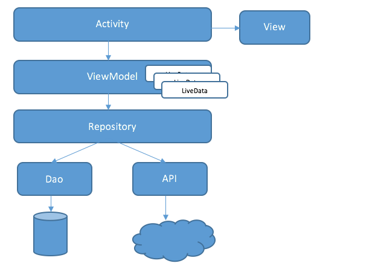
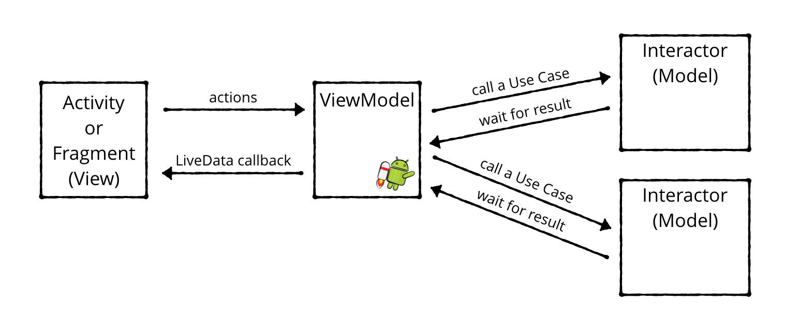

# TheLearningApp
App is a complete automation system for learning. 
Features
• Teachers classes, engaging video lessons, and personalised learning journeys. 
• Practise to perfection with adaptive exercises that ensure complete understanding of concepts.
• Revise with tests and practise sheets. The app comes with an adaptive Warm Up, Sprint, and Race Mode for each chapter
• Analyse your progress, strengths, and areas of improvement through real-time reports

# Youtube video streaming 
# Agora Video streaming, Classes.
# PDF Reading 
# Bookmark 
# Smart Login/Registration 

-> MVVM-clean architecture

